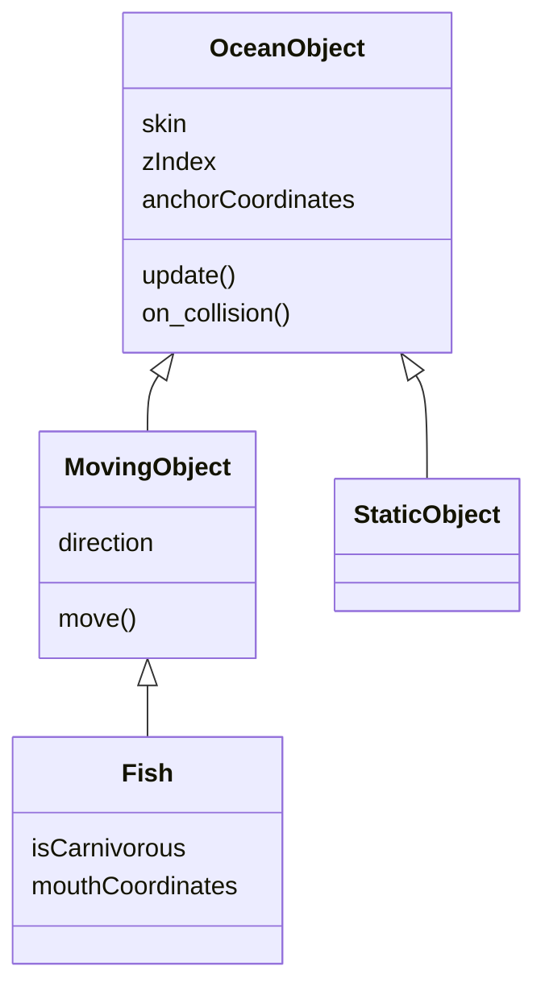

Here's the class hierarchy that is used in this project. (Work in progress)

# OceanObject
Base for all other classes.
# MovingObject
For objects that can move.
# StaticObject
Objects that don't move.
# Fish
Fishes